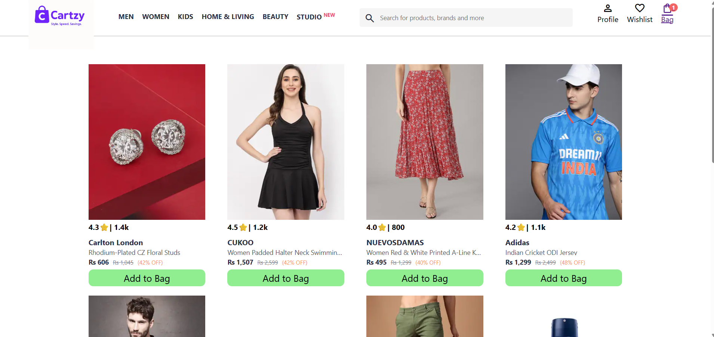
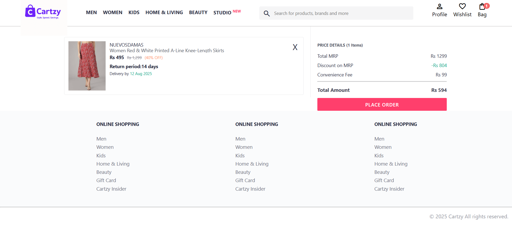

# 🛍️ Cartzy – E-Commerce Fashion Website

**Cartzy** is a simple front-end fashion e-commerce website created using HTML, CSS, and JavaScript. It allows users to add items to the cart and view a detailed bill on the cart page. The homepage is static and used for selecting predefined products.

---

## 🌐 Live Preview

🔗 **Live Site**: [kashif7180.github.io/cartzy](https://kashif7180.github.io/cartzy)

---

## 📁 Project Structure

cartzy/
├── css/
│ ├── bag.css # Cart page styles
│ └── index.css # Homepage styles
│
├── images/
│ ├── 1.jpg to 8.jpg # Product images
│ ├── cartzy.png # Brand image
│ └── cartzylogo.png # Logo
│
├── pages/
│ ├── bag.html # Cart page
│ └── bag.js # Cart logic
│
├── scripts/
│ └── index.js # Homepage interactivity
│
├── index.html # Homepage UI
├── cart.png # Screenshot of cart and billing
├── homepage.png # Screenshot of homepage
├── README.md # Project documentation

---

## ✅ Key Features

- 🛒 Add to Cart functionality with multiple item support  
- 📄 Billing calculation with live quantity and total updates  
- 💾 Stores cart data using **localStorage**  
- 🔢 Applies **discount calculations** in cart  
- 📱 Responsive layout with smooth UI  
- ✨ Static homepage for product selection  

---

## 📸 Screenshots

### 🖼 Homepage UI

### 🛍️ Cart & Billing

---

## 🛠️ Tech Stack

- HTML  
- CSS  
- JavaScript  
- LocalStorage (Browser API)

---

## 🔗 Project Links

- 💻 **GitHub Repository**: [github.com/Kashif7180/cartzy](https://github.com/Kashif7180/cartzy)  
- 🌐 **Live Demo**: [kashif7180.github.io/cartzy](https://kashif7180.github.io/cartzy)  

---

## 👨‍💻 Developer Info

**Syed Mohd Kashif Rizvi**  
📍 Noida, India  
📧 [kashif.cricfan@gmail.com](mailto:kashif.cricfan@gmail.com)  
🔗 GitHub: [Kashif7180](https://github.com/Kashif7180)  
🔗 LinkedIn: [linkedin.com/in/syed-mohd-kashif-rizvi-835492286](https://linkedin.com/in/syed-mohd-kashif-rizvi-835492286)

---

## 📌 Note

- The homepage is not interactive beyond product selection.  
- No search or filtering functionality is implemented.  
- All cart logic, billing, and discounts are handled on the **bag.html** page.
